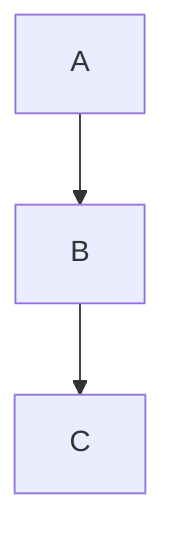

# Element-Plus-X 项目技能

## 项目概述
Element-Plus-X 是一个基于 Vue 3 + Element-Plus 的企业级 AI 组件库，提供了丰富的 AI 相关组件，如聊天气泡、会话管理、语音交互等，旨在为开发者提供开箱即用的 AI 场景化组件。

## 核心特性
- **企业级 AI 组件**：内置聊天机器人、语音交互等场景化组件
- **零配置集成**：基于 Element-Plus 设计体系，开箱即用
- **按需加载**：提供 Tree Shaking 优化
- **TypeScript 支持**：完整的类型定义
- **流模式支持**：提供流模式接口 Hooks，支持实时数据交互
- **语音识别**：集成浏览器内置语音识别 API
- **Markdown 渲染**：支持高级 Markdown 渲染，包括代码高亮、Mermaid 图表等

## 技术栈与框架特性

### 核心技术栈
- **前端框架**：Vue 3 (Composition API)
- **UI 库**：Element-Plus
- **构建工具**：Vite
- **包管理**：PNPM
- **类型系统**：TypeScript
- **组件文档**：Storybook
- **代码规范**：ESLint + Prettier + Oxlint

### 关键依赖
- **@element-plus/icons-vue**：Element Plus 图标库
- **@vueuse/core**：Vue 组合式 API 工具集
- **shiki**：代码语法高亮
- **mermaid**：图表渲染
- **dompurify**：HTML 净化
- **x-sender**：智能输入框核心
- **unified**：Markdown 处理管道
- **radash**：实用工具函数

## 项目结构与模块划分

### 整体结构
```
Element-Plus-X/
├── apps/                    # 应用目录
│   ├── docs/               # 文档站点
│   └── internal/           # 内部工具
├── packages/               # 包目录
│   └── core/              # 核心组件库
│       ├── src/            # 源码
│       │   ├── components/  # 组件实现
│       │   ├── hooks/       # Hooks 实现
│       │   ├── utils/       # 工具函数
│       │   └── stories/     # Storybook 示例
│       └── package.json     # 核心包配置
└── package.json            # 项目根配置
```

### 核心模块
1. **组件模块** (`src/components/`)：
   - **聊天相关**：Bubble、BubbleList、Conversations、Sender
   - **输入相关**：MentionSender、XSender
   - **展示相关**：Typewriter、Welcome、Prompts、FilesCard
   - **交互相关**：Attachments、Thinking、ThoughtChain
   - **渲染相关**：XMarkdown、XMarkdownAsync、XMarkdownCore

2. **Hooks 模块** (`src/hooks/`)：
   - **语音识别**：useRecord
   - **流模式**：useXStream、useSend、XRequest
   - **代码高亮**：usePrism

3. **工具模块** (`src/utils/`)：
   - **文件解析**：useFileNameParser
   - **滚动检测**：useScrollDetector

## 主要功能模块实现原理

### 1. 聊天气泡系统
- **Bubble 组件**：单个消息气泡，支持不同角色样式
- **BubbleList 组件**：消息列表，支持滚动加载、加载状态
- **实现原理**：使用 Vue 3 的 Composition API，通过 props 传递消息数据，使用 CSS 实现气泡样式和布局

### 2. 智能输入系统
- **Sender 组件**：智能输入框，支持文本输入、语音输入、发送按钮
- **MentionSender 组件**：支持提及功能的输入框
- **实现原理**：结合 Element Plus 的输入框组件，集成语音识别 API，处理输入事件和发送逻辑

### 3. Markdown 渲染系统
- **XMarkdown 组件**：高级 Markdown 渲染器
- **实现原理**：使用 unified 生态系统，结合 remark 和 rehype 插件，实现 Markdown 解析和 HTML 转换，支持代码高亮、Mermaid 图表等

### 4. 流模式处理
- **useXStream Hook**：处理流模式 API 调用
- **useSend Hook**：处理发送逻辑
- **实现原理**：使用 Promise 和 async/await，处理流式数据的接收和处理，支持实时更新

### 5. 语音识别系统
- **useRecord Hook**：封装浏览器语音识别 API
- **实现原理**：使用 Web Speech API，处理语音识别事件，转换为文本

## 关键 API 使用方法

### 1. 组件 API

#### BubbleList
```vue
<template>
  <BubbleList 
    :list="messageList" 
    :loading="loading" 
    @load-more="loadMore"
  />
</template>

<script setup>
import { ref } from 'vue';
import { BubbleList } from 'vue-element-plus-x';

const messageList = ref([
  { content: 'Hello', role: 'user' },
  { content: 'Hi there!', role: 'assistant' }
]);
const loading = ref(false);

function loadMore() {
  // 加载更多消息
}
</script>
```

#### Sender
```vue
<template>
  <Sender 
    @send="handleSend" 
    @voice="handleVoice"
  />
</template>

<script setup>
import { Sender } from 'vue-element-plus-x';

function handleSend(text) {
  console.log('发送文本:', text);
  // 处理发送逻辑
}

function handleVoice(text) {
  console.log('语音识别结果:', text);
  // 处理语音输入逻辑
}
</script>
```

#### XMarkdown
```vue
<template>
  <XMarkdown :content="markdownContent" />
</template>

<script setup>
import { ref } from 'vue';
import { XMarkdown } from 'vue-element-plus-x';

const markdownContent = ref(`
# Hello Element-Plus-X

## 特性
- 支持代码高亮
- 支持 Mermaid 图表

\`\`\`javascript
console.log('Hello World!');
\`\`\`


`);
</script>
```

### 2. Hooks API

#### useRecord
```javascript
import { useRecord } from 'vue-element-plus-x';

const {
  start,
  stop,
  isRecording,
  text,
  error
} = useRecord({
  lang: 'zh-CN',
  continuous: false
});

// 开始录音
start();

// 停止录音
stop();

// 监听识别结果
watch(text, (newText) => {
  console.log('识别结果:', newText);
});
```

#### useXStream
```javascript
import { useXStream } from 'vue-element-plus-x';

const {
  send,
  isLoading,
  result
} = useXStream({
  api: async (data) => {
    // 调用流模式 API
    return fetch('/api/stream', {
      method: 'POST',
      body: JSON.stringify(data)
    });
  }
});

// 发送请求
await send({ message: 'Hello' });

// 监听结果
watch(result, (newResult) => {
  console.log('流数据:', newResult);
});
```

## 项目最佳实践与编码规范

### 开发规范
- **代码风格**：使用 ESLint + Prettier 保持代码风格一致
- **类型安全**：使用 TypeScript，确保类型定义完整
- **组件设计**：遵循 Vue 3 Composition API 最佳实践
- **样式管理**：使用 SCSS 模块化管理样式
- **测试**：使用 Vitest 进行单元测试
- **文档**：使用 Storybook 展示组件用法

### 性能优化
- **按需加载**：支持 Tree Shaking，只引入需要的组件
- **懒加载**：对于大型组件（如 XMarkdown），建议按需引入
- **缓存策略**：合理使用 Vue 的响应式系统，避免不必要的重渲染
- **网络优化**：使用流模式 API，减少等待时间

### 部署建议
- **构建优化**：使用 Vite 构建，生成优化后的代码
- **CDN 加速**：对于生产环境，建议使用 CDN 加速静态资源
- **版本管理**：使用语义化版本号，避免破坏性更新

## 开发所需技能

### 核心技能
1. **Vue 3 开发**：熟练掌握 Composition API、Props、Emits 等
2. **TypeScript**：理解类型系统，能够编写类型安全的代码
3. **Element Plus**：熟悉 Element Plus 组件库的使用
4. **Markdown 处理**：了解 Markdown 解析和渲染原理
5. **Web API**：了解浏览器内置 API，如语音识别
6. **流数据处理**：理解流式 API 的工作原理

### 进阶技能
1. **组件设计**：能够设计可复用、可扩展的组件
2. **性能优化**：能够优化组件性能，减少重渲染
3. **测试策略**：能够编写单元测试和集成测试
4. **文档编写**：能够编写清晰的组件文档
5. **国际化**：支持多语言环境

## 常见问题与解决方案

### 1. 语音识别不工作
- **原因**：浏览器不支持 Web Speech API 或用户未授权麦克风
- **解决方案**：检查浏览器兼容性，添加权限请求和错误处理

### 2. Markdown 渲染性能问题
- **原因**：大型 Markdown 文档解析耗时
- **解决方案**：使用 XMarkdownAsync 组件，支持异步渲染

### 3. 流模式 API 连接问题
- **原因**：网络连接不稳定或 API 响应缓慢
- **解决方案**：添加超时处理和错误重试机制

### 4. 组件样式冲突
- **原因**：与现有 CSS 样式冲突
- **解决方案**：使用 CSS 隔离，如 scoped 样式或 CSS Modules

## 资源链接

- **官方文档**：[Element-Plus-X 文档](https://element-plus-x.com)
- **在线演示**：[在线预览](https://v.element-plus-x.com)
- **GitHub 仓库**：[Element-Plus-X](https://github.com/element-plus-x/Element-Plus-X)
- **NPM 包**：[vue-element-plus-x](https://www.npmjs.com/package/vue-element-plus-x)
- **交流社区**：[GitHub Issues](https://github.com/element-plus-x/Element-Plus-X/issues)

## 总结

Element-Plus-X 是一个功能丰富的企业级 AI 组件库，基于 Vue 3 和 Element-Plus 构建，提供了一系列专门为 AI 应用场景设计的组件和 Hooks。通过学习和使用 Element-Plus-X，开发者可以快速构建高质量的 AI 应用，如聊天机器人、语音助手等，而无需从零开始实现这些复杂的交互功能。

该项目采用现代化的前端技术栈，支持 TypeScript、按需加载、流模式等特性，为开发者提供了良好的开发体验和性能优化。同时，项目的模块化设计和完善的文档，使得组件的集成和定制变得简单直观。